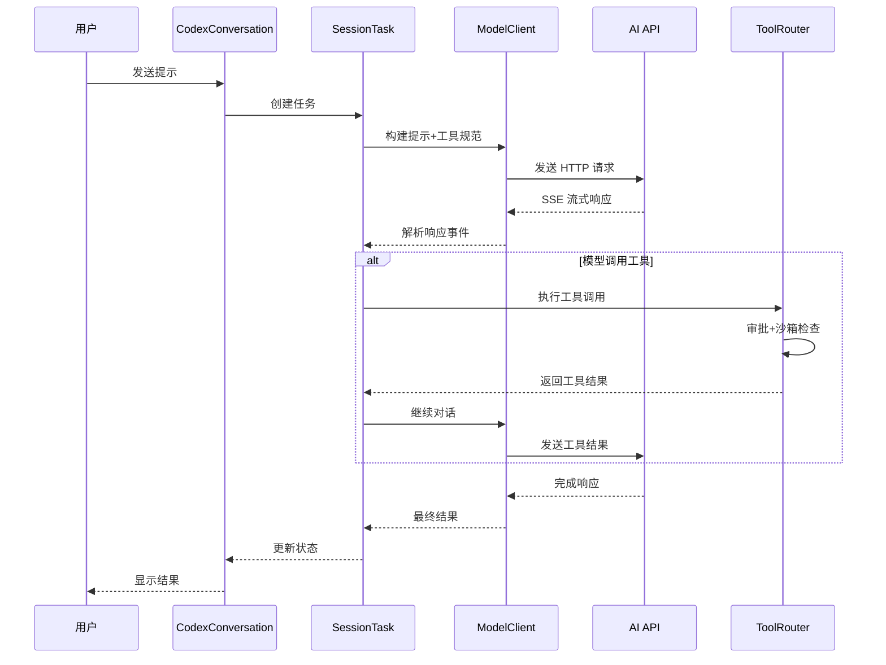
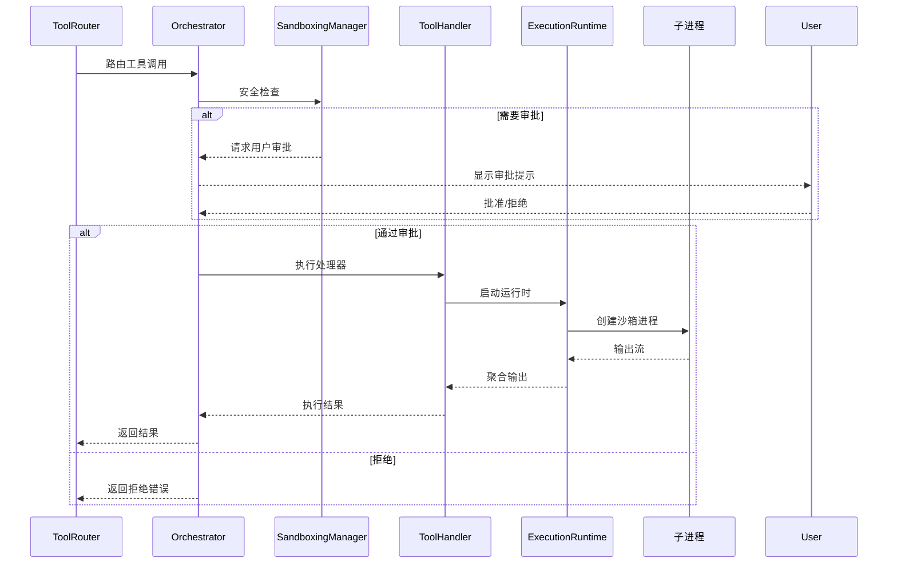
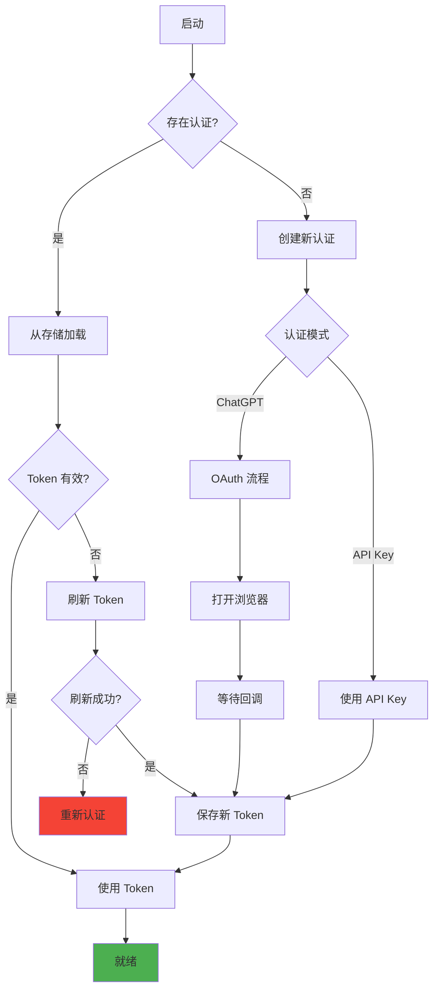
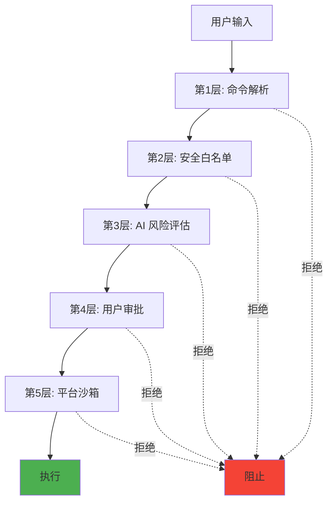

# Codex Core 架构文档

## 概览

`codex-core` 是 Codex 项目的核心 Rust 库，负责管理与 AI 模型的交互、工具执行、会话管理和安全沙箱等核心功能。

## 整体架构流程图

```mermaid
graph TB
    subgraph "用户交互层"
        User[用户] -->|输入命令/提示| CLI[CLI 接口]
    end

    subgraph "会话管理层"
        CLI --> ConvMgr[ConversationManager<br/>会话管理器]
        ConvMgr --> CodexConv[CodexConversation<br/>会话接口]
        CodexConv --> SessionState[SessionState<br/>会话状态]
        SessionState --> ActiveTurn[ActiveTurn<br/>活动轮次]
    end

    subgraph "任务执行层"
        CodexConv --> TaskMgr[SessionTask<br/>任务系统]
        TaskMgr --> RegularTask[RegularTask<br/>常规任务]
        TaskMgr --> CompactTask[CompactTask<br/>压缩任务]
        TaskMgr --> ReviewTask[ReviewTask<br/>审查任务]
        TaskMgr --> UndoTask[UndoTask<br/>撤销任务]
    end

    subgraph "配置管理层"
        Config[Config<br/>配置系统] --> ConfigLoader[ConfigLoader<br/>配置加载器]
        ConfigLoader --> Profile[ConfigProfile<br/>配置文件]
        ConfigLoader --> MCPServerConfig[MCPServerConfig<br/>MCP服务器配置]
    end

    subgraph "AI 客户端层"
        CodexConv --> ModelClient[ModelClient<br/>模型客户端]
        ModelClient --> AuthMgr[AuthManager<br/>认证管理器]
        ModelClient --> ProviderInfo[ModelProviderInfo<br/>提供者信息]
        ModelClient -->|HTTP/SSE| AIAPI[AI API<br/>OpenAI/Chat API]
    end

    subgraph "提示与上下文层"
        CodexConv --> CtxMgr[ContextManager<br/>上下文管理器]
        CtxMgr --> MsgHistory[MessageHistory<br/>消息历史]
        CtxMgr --> Truncate[Truncate<br/>截断处理]
        CodexConv --> Prompt[Prompt<br/>提示构建器]
        Prompt --> SysPrompt[系统提示]
        Prompt --> ToolsSpec[工具规范]
    end

    subgraph "工具系统层"
        CodexConv --> ToolRouter[ToolRouter<br/>工具路由器]
        ToolRouter --> Registry[ToolRegistry<br/>工具注册表]
        ToolRouter --> Orchestrator[ToolOrchestrator<br/>工具编排器]
        Orchestrator --> Approval[审批流程]
        Orchestrator --> Sandbox[沙箱检查]

        Registry --> Handlers[工具处理器]
        Handlers --> ReadFile[ReadFile]
        Handlers --> ShellHandler[Shell]
        Handlers --> ApplyPatch[ApplyPatch]
        Handlers --> GrepFiles[GrepFiles]
        Handlers --> MCPHandler[MCP]
        Handlers --> UnifiedExec[UnifiedExec]
    end

    subgraph "执行运行时层"
        Handlers --> Runtimes[执行运行时]
        Runtimes --> ShellRuntime[ShellRuntime<br/>Shell运行时]
        Runtimes --> PatchRuntime[PatchRuntime<br/>补丁运行时]
        Runtimes --> UnifiedRuntime[UnifiedExecRuntime<br/>统一执行运行时]

        UnifiedRuntime --> SessionMgr[SessionManager<br/>会话管理器]
        SessionMgr --> PTY[PTY会话]
        PTY --> Process[子进程]
    end

    subgraph "安全沙箱层"
        Sandbox --> SandboxMgr[SandboxingManager<br/>沙箱管理器]
        SandboxMgr --> Assessment[AI 风险评估]
        SandboxMgr --> Platform[平台沙箱]
        Platform --> Landlock[Landlock<br/>Linux]
        Platform --> Seatbelt[Seatbelt<br/>macOS]
        Platform --> WindowsSB[Windows 沙箱]

        SandboxMgr --> CmdSafety[CommandSafety<br/>命令安全]
        CmdSafety --> SafeCmd[安全命令白名单]
        CmdSafety --> DangerCmd[危险命令检测]
    end

    subgraph "MCP 集成层"
        MCPHandler --> MCPConnMgr[MCPConnectionManager<br/>MCP连接管理器]
        MCPConnMgr --> MCPAuth[MCP 认证]
        MCPConnMgr --> MCPServers[MCP 服务器实例]
        MCPServers -->|stdio/SSE| ExtTools[外部工具]
    end

    subgraph "存储层"
        CodexConv --> Rollout[RolloutRecorder<br/>会话记录器]
        Rollout --> FSStorage[文件系统存储]
        FSStorage --> Sessions[会话文件]
        AuthMgr --> AuthStorage[AuthStorage<br/>认证存储]
        AuthStorage --> Keychain[密钥链/文件]
    end

    subgraph "错误处理层"
        ErrorSys[CodexErr<br/>错误系统] --> AllLayers[所有层级]
    end

    Config --> CodexConv

    style User fill:#e1f5fe
    style AIAPI fill:#fff3e0
    style ExtTools fill:#f3e5f5
    style Process fill:#e8f5e9
    style FSStorage fill:#fce4ec
```

## 核心数据流

### 1. 用户请求处理流程

### 2. 工具执行流程

### 3. 配置加载流程

### 4. 认证流程

## 模块职责划分

### 核心层模块

| 模块 | 职责 | 关键文件 |
|------|------|----------|
| **会话管理** | 管理对话生命周期和状态 | `conversation_manager.rs`, `codex_conversation.rs` |
| **任务系统** | 执行不同类型的任务 | `tasks/mod.rs`, `tasks/regular.rs` |
| **状态管理** | 维护会话和轮次状态 | `state/session.rs`, `state/turn.rs` |
| **上下文管理** | 管理对话历史和上下文 | `context_manager/history.rs` |

### 通信层模块

| 模块 | 职责 | 关键文件 |
|------|------|----------|
| **模型客户端** | 与 AI API 通信 | `client.rs`, `client_common.rs` |
| **认证管理** | 管理认证和令牌 | `auth.rs`, `auth/storage.rs` |
| **提供者管理** | 管理多模型提供者 | `model_provider_info.rs` |
| **流式处理** | 处理 SSE 响应流 | `client.rs`, `chat_completions.rs` |

### 工具层模块

| 模块 | 职责 | 关键文件 |
|------|------|----------|
| **工具路由** | 分发工具调用 | `tools/router.rs` |
| **工具注册** | 注册和管理工具 | `tools/registry.rs` |
| **工具编排** | 审批和沙箱流程 | `tools/orchestrator.rs` |
| **工具处理器** | 具体工具实现 | `tools/handlers/*` |
| **执行运行时** | 管理进程执行 | `tools/runtimes/*` |

### 安全层模块

| 模块 | 职责 | 关键文件 |
|------|------|----------|
| **沙箱管理** | 跨平台沙箱抽象 | `sandboxing/mod.rs` |
| **命令安全** | 命令安全检查 | `command_safety/*` |
| **风险评估** | AI 驱动的风险分析 | `sandboxing/assessment.rs` |
| **平台沙箱** | 平台特定实现 | `landlock.rs`, `seatbelt.rs` |

### 配置层模块

| 模块 | 职责 | 关键文件 |
|------|------|----------|
| **配置系统** | 配置加载和管理 | `config/mod.rs` |
| **配置加载器** | 分层配置加载 | `config_loader/mod.rs` |
| **配置编辑** | 原子性配置更新 | `config/edit.rs` |
| **配置文件** | Profile 管理 | `config/profile.rs` |

### 集成层模块

| 模块 | 职责 | 关键文件 |
|------|------|----------|
| **MCP 集成** | Model Context Protocol | `mcp/mod.rs` |
| **MCP 连接** | MCP 服务器连接 | `mcp_connection_manager.rs` |
| **Git 集成** | Git 信息收集 | `git_info.rs` |
| **项目文档** | 项目文档加载 | `project_doc.rs` |

### 存储层模块

| 模块 | 职责 | 关键文件 |
|------|------|----------|
| **会话记录** | 会话持久化 | `rollout/recorder.rs` |
| **会话列表** | 会话查询和分页 | `rollout/list.rs` |
| **消息历史** | 历史记录管理 | `message_history.rs` |

## 关键设计模式

### 1. 策略模式
- **用途**: 多平台沙箱实现
- **示例**: `Landlock`、`Seatbelt`、`WindowsSandbox`

### 2. 建造者模式
- **用途**: 配置构建、提示构建
- **示例**: `Prompt`、`ConfigEditsBuilder`

### 3. 观察者模式
- **用途**: 事件发射和监听
- **示例**: `ToolEventSender`、`ResponseStream`

### 4. 工厂模式
- **用途**: 工具创建、客户端创建
- **示例**: `create_tools_json_for_responses_api`

### 5. 责任链模式
- **用途**: 工具审批流程
- **示例**: `ToolOrchestrator` → `SandboxingManager` → `CommandSafety`

## 性能优化

### 并发执行
- 并行工具执行: `ParallelRuntime`
- 异步 I/O: 全面使用 `tokio`
- 流式响应: SSE 实时流

### 内存优化
- 上下文截断: 自动截断大输出
- 会话压缩: `CompactTask`
- 增量更新: 仅发送差异

### 缓存策略
- Prompt 缓存: `prompt_cache_key`
- Token 缓存: 缓存输入 token
- 配置缓存: 延迟加载

## 安全架构

### 多层防御

### 沙箱隔离级别

| 平台 | 技术 | 文件访问 | 网络访问 | 系统调用 |
|------|------|----------|----------|----------|
| Linux | Landlock + seccomp | 受限路径 | 禁止 | 白名单 |
| macOS | Seatbelt | 受限路径 | 禁止 | 白名单 |
| Windows | 待实现 | - | - | - |

## 扩展点

### 添加新工具

1. 在 `tools/handlers` 创建处理器
2. 实现 `ToolHandler` trait
3. 在 `ToolRegistry` 注册
4. 在 `tools/spec.rs` 添加规范

### 添加新模型提供者

1. 在 `model_provider_info.rs` 添加配置
2. 选择 `WireApi` (Responses 或 Chat)
3. 配置认证方式
4. 添加到 `built_in_model_providers`

### 添加新任务类型

1. 在 `tasks/` 创建新任务模块
2. 实现 `SessionTask` trait
3. 在 `TaskKind` 枚举添加变体
4. 在任务路由器中处理

## 未来规划

- [ ] Windows 沙箱支持
- [ ] 更多 MCP 服务器集成
- [ ] 增强的缓存机制
- [ ] 工具执行性能优化
- [ ] 更细粒度的权限控制
- [ ] 插件系统架构
